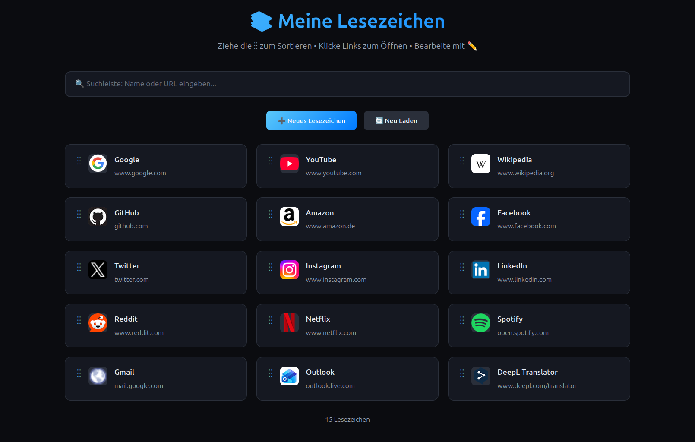

# LesezeichenWerk


**LesezeichenWerk** ist ein schlankes Tool, um Links sauber zu sammeln, zu kategorisieren und schnell wiederzufinden. Kein Browser-Chaos, keine vergessenen Ressourcen.

## 📸 Screenshot



## ✨ Funktionen
- Links speichern und taggen
- Kategorien für strukturierte Sammlung
- Schnellsuche
- Notizen pro Link
- Export/Import als JSON
- Serverbasierte Speicherung

## 🎯 Ziel
Maximale Übersicht, minimale Reibung. Weniger Tabs, mehr Fokus.

## 🚀 Installation

```bash
git clone https://github.com/MDV-Code/lesezeichenwerk.git
cd lesezeichenwerk
```

## 📋 Voraussetzungen
- PHP 7.4 oder höher
- Webserver (Apache, Nginx, etc.)
- Schreibrechte für das Verzeichnis

## ⚙️ Einrichtung

1. Projekt in das Webverzeichnis kopieren:
```bash
cp -r lesezeichenwerk /var/www/html/
```

2. Schreibrechte für die JSON-Datei setzen:
```bash
chmod 755 /var/www/html/lesezeichenwerk/
chmod 666 /var/www/html/lesezeichenwerk/bookmarks.json
```

3. Webserver starten und im Browser öffnen:
```bash
# Bei lokaler Entwicklung mit PHP Built-in Server:
php -S localhost:8000
```

4. Im Browser öffnen: `http://localhost:8000`

## 📁 Projektstruktur
```
lesezeichenwerk/
├── index.html          # Frontend-Oberfläche
├── api.php            # PHP Backend-API
├── bookmarks.json     # Lesezeichen-Datenbank
├── screenshot.png     # Anwendungs-Screenshot
└── README.md
```

## 🔌 API Endpoints

Die API bietet folgende Endpoints:

- `GET api.php?action=get` - Alle Lesezeichen abrufen
- `POST api.php?action=add` - Neues Lesezeichen hinzufügen
- `POST api.php?action=update` - Lesezeichen aktualisieren
- `POST api.php?action=delete` - Lesezeichen löschen

## 🛠️ Technologie
- **Frontend**: HTML, CSS, JavaScript
- **Backend**: PHP
- **Datenbank**: JSON-Datei
- **API**: REST-ähnliche Schnittstelle

## 🔒 Sicherheitshinweise
- Stellen Sie sicher, dass das `bookmarks.json` nicht direkt über den Browser zugänglich ist
- Konfigurieren Sie ggf. entsprechende .htaccess Regeln
- Für Produktivumgebungen empfiehlt sich eine echte Datenbank

## 📄 Lizenz
MIT

## 📊 Status
MVP im Aufbau. Fokus liegt auf Einfachheit, Geschwindigkeit und Alltagstauglichkeit.
